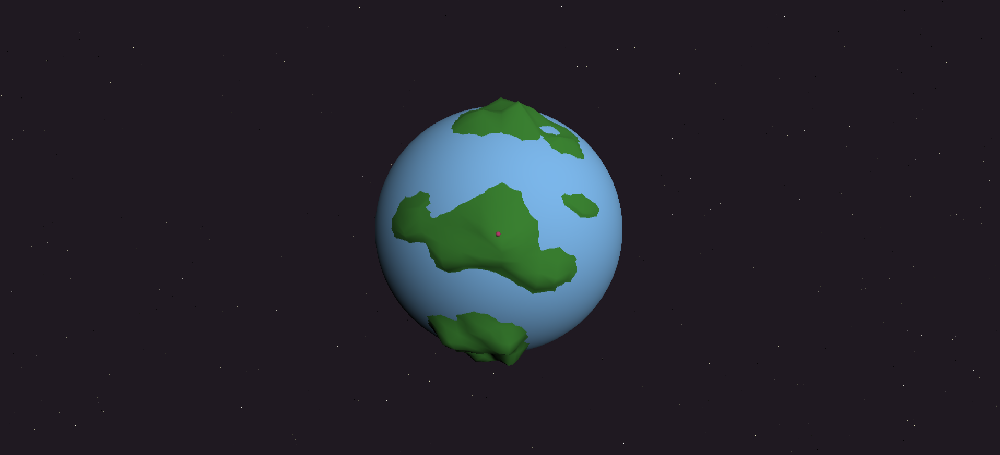

# `Terrav.rm`

## TL;DR

**Dit is een school project voor het vak Creative Coding.**

**`beschrijving`**

De Aarde is helemaal uitgeput en is niet meer leefbaar, dus zal jij een nieuwe moeten maken. Maak aan de hand van terravorming een nieuwe leefbare planeet. Vorm de planeet met een interactieve bal-besturing. De software bestaat voornamelijk uit JavaScript dat gebruik maakt van de **Three.js** library.

> [Three.js](https://threejs.org/)

## Benodigdheden

| `items`                              | `software`                 |
| ------------------------------------ | -------------------------- |
| Raspberry Pi                         | Node-red                   |
| Laptop                               | Vite , Three.js , Node-red |
| Beamer                               | none                       |
| Bal naar keuze _(omtrek 65 - 67cm)_  | none                       |
| Bal besturing _(muis, 4 deorollers)_ | Illustrator                |
| Knop                                 | Node-red, Illustrator      |

## Installs

**Vite** installeren

    $ npm install --save-dev vite

**Three.js** installeren

    $ npm install --save three

**Three.js Object controls**

    $ npm install --save threejs-object-controls

> [Object controls](https://github.com/albertopiras/threeJS-object-controls)

**Node-red** installeren op _Raspberry Pi_

    sudo npm install -g --unsafe-perm node-red

_!op windows het commando niet starten met "sudo"_

## Code

**html**

    <!DOCTYPE html>
        <html lang="en">
        <head>
    <meta charset="UTF-8" />
    <link rel="icon" type="image/svg+xml" href="/public/vite.svg" />
    <meta name="viewport" content="width=device-width, initial-scale=1.0" />
    <title>terrav.rm</title>
      </head>
      <body>
        <canvas class="bg"></canvas>
        
      </body>
    </html>

**CSS**

    body{
      background-color: rgb(31, 24, 30);
    }

    canvas{
      width: 50vw;
      position: fixed;
      top: 0;
      left: 0;
      cursor: default;
    }

**JavaScript**

Om de **Three.js** en **CSS** te koppelen moet je deze files importeren

    import './style.css';
    import * as THREE from 'three';
    import {ObjectControls} from 'threeJS-object-controls';

## Node-red

**Code websocket**

_!ip vervangen door ip van Raspberry gebruiker_

    function wsConnect() {
      var ws = new WebSocket("ws://192.168.100.1:1880/ws");

      ws.onmessage = function (msg) {
         console.log('ws');
          document.querySelector('canvas').click();
      }

      ws.onopen = function () {
          console.log("Connected");

      }

      ws.onclose = function () {
        setTimeout(wsConnect, 3000);
      }

      ws.disconnect = function () {
          console.log("Disconnected");
      }
    }

## Planeet

_hoe zit de planeet in elkaar?_

**`beschrijving`**

De planeet bestaat uit **drie verschillende bollen** dat op dezelfde positie staan. De blauwe bol staat net **1 pixel** groter dan de twee groene onderste bollen. De blauwe bol heeft als property dat hij niet klikbaar is, hierdoor worden de twee onderste bollen wel klikbaar. Waardoor ze met een mouseclick naar boven vormen.

**code bollen**

    const geometry = new THREE.SphereGeometry( 15, 50, 50 );
    const material = new THREE.MeshStandardMaterial({color: 0x2e6930, wireframe:false});
    const sphere = new THREE.Mesh(geometry, material,);
    scene.add(sphere);

    const geometryD = new THREE.SphereGeometry( 15, 50, 50 );
    const materialD = new THREE.MeshStandardMaterial({color: 0x2e6930, wireframe:false});
    const sphereD = new THREE.Mesh(geometryD, materialD);
    scene.add(sphereD);

    const geometryO = new THREE.SphereGeometry( 15.1, 400, 400 );
    const materialO = new THREE.MeshStandardMaterial({color: 0x6495ED, wireframe:false} );
    const OuterSphere = new THREE.Mesh(geometryO, materialO,);
    scene.add(OuterSphere);

**code functie land maken**

          raycaster.setFromCamera(clickMouse, camera);
      const found = raycaster.intersectObjects(scene.children.filter(obj => obj !== OuterSphere && obj  !== Maker));
      if (found.length > 0 && (found[0].object).geometry){
          const mesh = found[0].object
          if (mesh === OuterSphere){
            return;
          }
          const geometry = mesh.geometry
          const point = found[0].point
          const isSphereD = mesh === sphereD;
          const isSphere = mesh === sphere;

          for (let i = 0; i  < geometry.attributes. position.count; i++) {
              vector3.setX(geometry.attributes.position.getX(i))
              vector3.setY(geometry.attributes.position.getY(i))
              vector3.setZ(geometry.attributes.position.getZ(i))
              const toWorld = mesh.localToWorld(vector3)
              const distance = point.distanceTo(toWorld)
              if (distance < MAX_CLICK_DISTANCE) {
                  if (isSphereD) {
                      geometry.attributes.position.setY (i, geometry.attributes.position.getY(i) - (MAX_CLICK_DISTANCE - distance) / 2);
                      console.log("create land down")
                  }
                  if (isSphere){
                      geometry.attributes.position.setY (i, geometry.attributes.position.getY(i) + (MAX_CLICK_DISTANCE - distance) / 2);
                      console.log("create land up")
                  }
              }
          }
          geometry.computeVertexNormals()
          geometry.attributes.position.needsUpdate = true
        }
    });

## Besturing

**`beschrijving`**

De besturing bestaad uit een platform met drie pilaren dat de bal steun geeft. Op het platform staat één deoroller dat het belangrijkste contactpunt is met de bal. De drie andere deorollers staan verbonden met de steunpilaren en zorgen ervoor dat de bal stabiel blijft.

**`technische tekening`**

**`laser cut-out`**

**`laser cut-out knop`**

